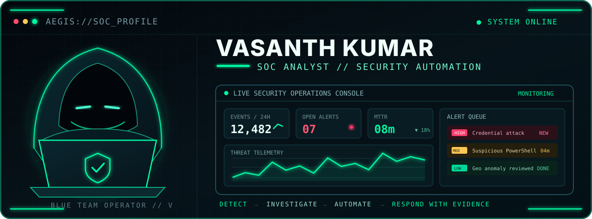

 

  

---

## `// OPERATOR_PROFILE`

<table>
<tr>
<td width="50%" valign="top">

<h3>🛡️ Profile Intel</h3>

<ul>
  <li><strong>B.Sc. Cybersecurity & Digital Forensics</strong> graduate — 2026</li>
  <li>Focused on SOC monitoring, alert triage, threat hunting, incident response, and DFIR</li>
  <li>Hands-on with SIEM workflows, IOC enrichment, MITRE ATT&CK mapping, and endpoint telemetry</li>
  <li>Building practical, evidence-driven security projects for real operational workflows</li>
</ul>

</td>
<td width="50%" valign="top">

<h3>📡 Current Mission</h3>

<ul>
  <li>Improve investigation speed while keeping analyst control</li>
  <li>Build safe automation using approval gates and audit trails</li>
  <li>Strengthen detection engineering and incident communication</li>
  <li>Open to entry-level <strong>SOC Analyst</strong> and <strong>Security Analyst</strong> roles</li>
</ul>

</td>
</tr>
</table>

## `// SECURITY_STACK`

<table>
<tr>
<td width="50%" valign="top" align="center">
<h4>📡 SIEM // MONITORING // ENDPOINT</h4>

</td>
<td width="50%" valign="top" align="center">
<h4>🌐 NETWORK // DETECTION // INTEL</h4>

</td>
</tr>
<tr>
<td width="50%" valign="top" align="center">
<h4>⚔️ VAPT // WEB SECURITY</h4>

</td>
<td width="50%" valign="top" align="center">
<h4>🔬 DFIR // DETECTION ENGINEERING</h4>

</td>
</tr>
<tr>
<td colspan="2" valign="top" align="center">
<h4>⚙️ AUTOMATION // DEVSECOPS</h4>

</td>
</tr>
</table>

| Security Area | Operational Capability |
|---|---|
| **SIEM & Monitoring** | Splunk, Wazuh, Microsoft Sentinel, Sysmon |
| **Detection & Response** | Alert triage, MITRE ATT&CK, IOC enrichment, YARA, VirusTotal |
| **Network & AppSec** | Wireshark, Nmap, Burp Suite |
| **Automation** | Python, PowerShell, Bash, FastAPI, Docker, n8n |
| **Cloud & Development** | Azure, GitHub Actions, TypeScript, React |

## `// FEATURED_OPERATIONS`

<table>
<tr>
<td width="50%" valign="top">

<h3>01 — <a href="https://github.com/vasanth-void-0x/Identity-Threat-Response-Automation-Platform">iTRAP</a></h3>

<strong>Identity Threat Response Automation Platform</strong>

Identity threat detection, risk scoring, investigation, and response automation.

</td>
<td width="50%" valign="top">

<h3>02 — <a href="https://github.com/vasanth-void-0x/AegisFlow-SOC-Automation">AegisFlow</a></h3>

<strong>SOC Investigation &amp; Response Orchestrator</strong>

Alert enrichment, RAG-assisted investigation, MCP security tools, audit logging, and human approval gates.

</td>
</tr>
<tr>
<td width="50%" valign="top">

<h3>03 — <a href="https://github.com/vasanth-void-0x/AgentShield---AI-Gateway">AgentShield</a></h3>

<strong>Agentic Security Gateway</strong>

Policy enforcement, safe tool access, prompt protection, secret redaction, and auditability.

</td>
<td width="50%" valign="top">

<h3>04 — <a href="https://github.com/vasanth-void-0x/DFIR-Copilot">DFIR Copilot</a></h3>

<strong>Evidence-First Digital Forensics Workbench</strong>

Structured evidence handling, timeline investigation, integrity validation, and analyst-ready reporting.

</td>
</tr>
<tr>
<td width="50%" valign="top">

<h3>05 — <a href="https://github.com/vasanth-void-0x/ChainGuard">ChainGuard</a></h3>

<strong>Automated DevSecOps Security Pipeline</strong>

Repeatable SAST, secret, container, and software supply-chain scanning with actionable findings.

</td>
<td width="50%" valign="top">

<h3>⚡ Operating Principle</h3>
<pre>DETECT
  └─ INVESTIGATE
       └─ AUTOMATE SAFELY
            └─ RESPOND WITH EVIDENCE</pre>

</td>
</tr>
</table>
---

### `vasanth@soc:~$ connect --secure`

**Interested in SOC operations, blue-team security, DFIR, and security automation opportunities.**

[LinkedIn](https://www.linkedin.com/in/vasanth-2k4) · [Email](mailto:iamvasanth2k4@gmail.com) · [Portfolio](https://vasanth-portfolio-ten.vercel.app/) · [Repositories](https://github.com/vasanth-void-0x?tab=repositories)

 

SECURITY-FIRST // EVIDENCE-DRIVEN // HUMAN-IN-CONTROL

